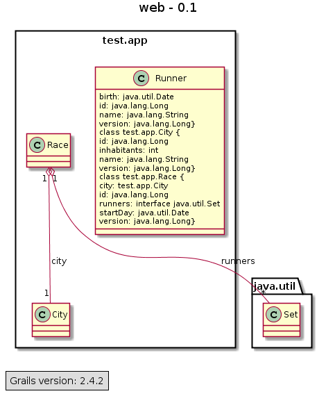

grails-plugin-to-uml
=============================

Generate UML diagrams from your Grails app source code.

## Features
  1. [TODO] Global Class diagrams (layered) for Controllers & Services & other beans (only public methods, no javadoc comments)
  1. [TODO] Global Class diagrams for Domain  
  1. [TODO] Diagram generation in PNG via plantUML.jar from [PlantUML project](http://plantuml.sourceforge.net/)
  1. [TODO] Diagrams exposed as specific UmlController (http interface)
  1. [TODO] Diagrams exposed as a grails script: "grails to-uml" (cli interface)
  1. [TODO] HTML summary page using online [PlantUML server](http://www.plantuml.com/plantuml) (ie no need to rely on plantUML.jar - no local image generation) 
  1. [TODO] HTML summary page using online [yUML](http://www.yuml.me/diagram/scruffy/class/draw) (different syntax)
  1. [TODO] Inclusion in standard gdoc process
  1. [TODO] document specifically webapp interfaces (public methods of Controllers, with javadoc, input/output spec?) 
  
## Finished dev tasks  
* (Igor v0.2.0) Refactor (pass1) script / controller / service (UmlController | UmlService | PlantUmlService |YumlService)
* (Igor v0.2.0) domain >> all fields not external (ie excluding hasmany)
* (Igor v0.2.0) domain introspection result to diagram spec
* (Igor v0.2.1) domains >> list dependencies (hasmany)1
  
## Ongoing dev tasks  
Started refactoring previous work - perimeter: 
* (Igor) Refactor (pass2) script / controller / service (UmlController | UmlService | PlantUmlService |YumlService)

## Future dev tasks  
* domain >> filter fields via config parameter (eg: exclude id and version)
* grails introspect 
  * controllers >> list dependencies
  * services >> list dependencies
  * controllers, services >> public methods
  * introspection result to diagram spec
* plantUml Class diagram spec (non trivial example)
* plantUml Dependency diagram spec (non trivial example)
* plantUml diagram spec to PNG file
* plantUml diagram spec to PNG byteStream  
* Yuml as secondary option
* script : controller/services/domains >> to PNG files
* UmlController : html file containing 1 link to 1 generated PNG file
* UmlController : controller/services/domains >> to html file containing links to generated PNG files
* Config options
* gdoc inclusion

  
## Inspiration from 
* http://grails.org/plugin/class-domain-uml
* http://www.grails.org/plugin/create-domain-uml
* https://github.com/david-w-millar/grails-plantuml-plugin
* https://code.google.com/p/grails-domain-uml/source/browse/#svn%2FCreateDomainUml

## Installation

[TODO]
Add `runtime ":to-uml:0.2.0"` to **BuildConfig.groovy** in plugins section (requires grails 2.0 > *).

## Development

* Create a web-app: `grails create-app web` 
* Add in BuildConfig of this new projet (adjust path as needed): 
    grails.project.fork = [
        test: false , 
        run: false , 
        war: false , 
        console: false , 
    ]
    grails.reload.enabled = true
    grails.plugin.location.'to-uml'="../grails-plugin-class-domain-uml"`

Apart from the last line, we're basically turning off grails 2.3 forking process, which hampers auto-reload. 

From then on, you can modify code in the plugin, and your "web" application reflects the changes immediately.

## Usage

Run your app and navigate to `http://localhost:8080/yourApp/uml`

## Screenshots

[TODO] 
