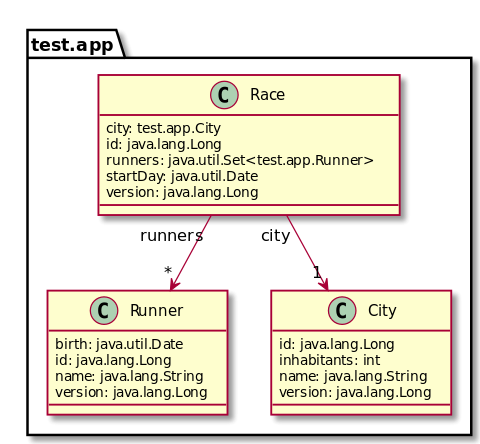
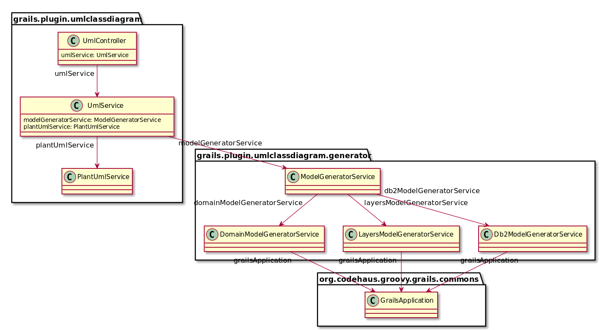

grails-plugin-uml-class-diagram
===============================

Generate UML diagrams from your Grails app source code.

Documentation:  

* [User Guide](http://igorrosenberg.github.io/grails-plugin-uml-class-diagram/)
* [Plugin shared with the Grails Community](http://grails.org/plugin/uml-class-diagram) 
* [Source code on GitHub](https://github.com/igorrosenberg/grails-plugin-uml-class-diagram/) (this page) 

## Screenshots






## Usage

See the [User Guide](http://igorrosenberg.github.io/grails-plugin-uml-class-diagram/)

## Features

  1. :white_check_mark: Global Class diagrams for Domain (see screenshot section above)
  1. :white_check_mark: Global Class diagrams (layered) for Controllers & Services & other beans (see screenshot section above)
  1. :white_check_mark: Global Class diagrams from DB2 database dump
  1. :white_check_mark: Diagrams exposed as specific UmlController (http interface) (see screenshot section above)
  1. :white_check_mark: Diagram generation via plantUML.jar from [PlantUML project](http://plantuml.sourceforge.net/)
  1. :white_check_mark: Configuration of the output (html wizard or directly through http GET parameters)
  1. :white_check_mark: Image output types: SVG, ~~PNG~~
  1. :clock9: Diagrams exposed as a grails script: "grails to-uml" (cli interface)
  1. :clock9: Inclusion in standard gdoc process
  1. :clock9: Output compatible with diagram manipulation software
  1. :no_entry: (Out of the scope of this plugin) ~~Document specifically webapp interfaces (public methods of Controllers, with javadoc, input/output spec?)~~ 
  1. :no_entry: (No longer considered useful) ~~Diagram generation using online [PlantUML server](http://www.plantuml.com/plantuml)~~ 
  1. :no_entry: (No longer considered useful) ~~Diagram generation using online [yUML](http://www.yuml.me/diagram/scruffy/class/draw)~~
  
## Finished tasks

* (v0.2.0) Refactor (pass1) script / controller / service (UmlController | UmlService | PlantUmlService |YumlService)
* (v0.2.0) domain introspection result to diagram spec
* (v0.2.0) domain >> all fields not external (ie excluding hasmany)
* (v0.2.1) domain >> list dependencies (hasmany)
* (v0.2.3) Config options (fieldFilterRegexps classFilterRegexps showCanonicalJavaClassNames diagramType)
* (v0.2.4) grails introspect
  * controllers >> list dependencies
  * services >> list dependencies
* (v0.2.5) Config options (showGrailsInternals)
* (v0.2.6) plantUml diagram spec to PNG byteStream, 
* (v0.2.6) Config options (renderingEngine)
* (v0.3.0) plantUml diagram spec to PNG file (script mode)
* (v0.3.1) published as public grails plugin, see http://grails.org/plugin/uml-class-diagram
* (v0.3.2) GSP View exposing the Config Command object
* (v0.3.3) grails docs, see [github gh-pages](http://igorrosenberg.github.io/grails-plugin-uml-class-diagram/)
* (v0.3.4) moved extra info from readme to user guide, see [github gh-pages](http://igorrosenberg.github.io/grails-plugin-uml-class-diagram/)
* (v0.4.0) Refactored for common algorithm: "read model > uml script > image"
  
## Ongoing tasks  


* :warning: separate README.md (dev) from src/docs/guide (usage)
* Script builds a Config Command object (script parameters and/or config options)
* Config options (showCanonicalClassNames duplicateFieldAndArrow)
* Config option: no duplication = if isAssociation, don't list in properties
* Documentation of the plugin (specifically: ConfigurationCommand, controller mode, script mode, rendering engines) - see gh-pages git branch

## Future tasks (help needed!)

* ~~Correct UmlService (Graph representation) ==> in the classData, the associations field is a duplicate of the properties field~~
* ~~grails introspect controllers, services >> public methods~~ (currently out of the scope of this UML plugin)
* ~~plantUml Class diagram spec (non trivial example)~~
* ~~plantUml Dependency diagram spec (non trivial example)~~
* ~~Refactor UmlService (too much duplication) ==> Domain vs Controller/Service should not be separate methods~~
  * ~~see grailsApplication.serviceClasses() , can that help ?~~
* ~~Refactor (pass2) UmlController | UmlService | PlantUmlService |YumlService~~
* ~~Yuml as secondary option~~
* gdoc inclusion of the script
* Correct UML arrows (field inclusion should be represented by a diamond)
* Use proper reflexion on Domains and Services, see FIXME in code
* script : controller/services/domains >> to image files in target output folder 
```
    includeTargets << grailsScript("_GrailsBootstrap")
    loadApp()
    for (grailsClass in grailsApp.allClasses) { println grailsClass }

    configureApp()
    Connection c = appCtx.getBean('dataSource').getConnection()
```  

## Installation

Add `runtime ":uml-class-diagram:0.4.0"` to *BuildConfig.groovy* in the plugins section (requires grails 2.0 > \*).

The plugin depends on GraphViz. You may install it through your favorite package manager 
or via [http://www.graphviz.org/Download.php](http://www.graphviz.org/Download.php).

## Development

The steps described below are available in a [dedicated test app](https://github.com/igorrosenberg/test-grails-app/tree/local-uml-plugin)

* Create a web-app: `grails create-app web` 
* Add in BuildConfig of this new projet (adjust path as needed): 
```
grails.project.fork = [
  test: false , 
  run: false , 
  war: false , 
  console: false , 
]
grails.reload.enabled = true
grails.plugin.location.'uml-class-diagram'="../grails-plugin-uml-class-diagram"
```

Apart from the last line, we're basically turning off grails 2.3 forking process, which hampers auto-reload. 

You may also need to add _grails.reload.enabled = true_ to ../grails-plugin-uml-class-diagram/.../BuildConfig.groovy  

From then on, you can modify code in the plugin, and your "web" application reflects the changes immediately (extra step: maybe you need to run it with `grails -reloading run-app`). 

## Inspiration from 

* http://grails.org/plugin/class-domain-uml
* http://www.grails.org/plugin/create-domain-uml
* https://github.com/trygvea/grails-class-diagram/
* https://github.com/david-w-millar/grails-plantuml-plugin
* https://code.google.com/p/grails-domain-uml/source/browse/#svn%2FCreateDomainUml
* http://sdedit.sourceforge.net/
* https://www.websequencediagrams.com/

